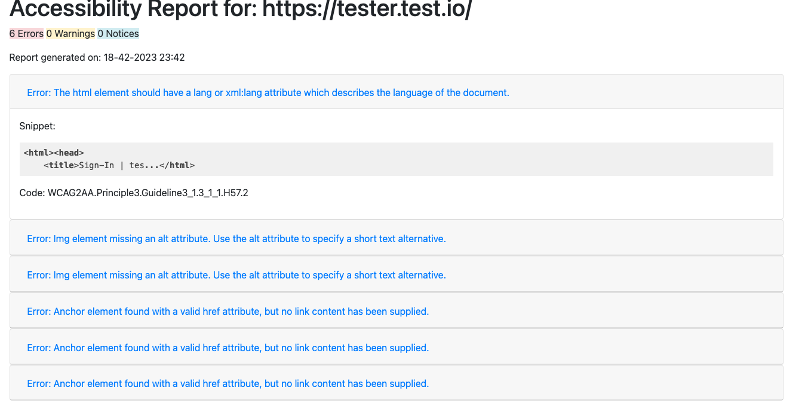
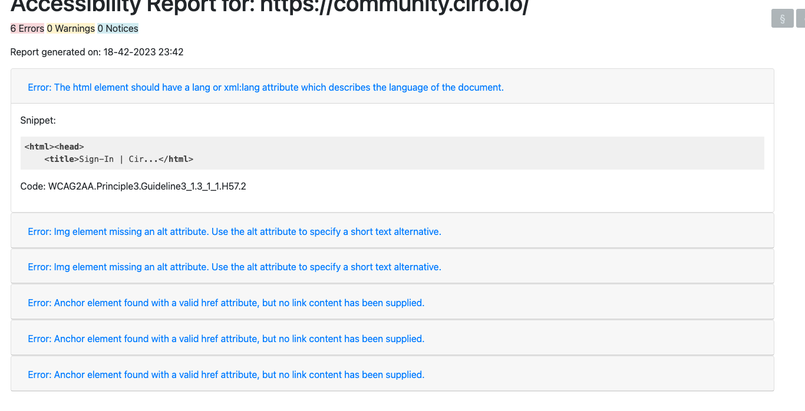

## This project is private and only used for EPAM ``ers``

### The project includes Jest + Puppeteer + Pa11y (only for accessibility testing)

This site was built using [Pa11y tutorials](https://pa11y.org/tutorials/) for accessibility.
The project is built for UI testing using [Puppeteer](https://pptr.dev/) and the test runner [JEST](https://jestjs.io/docs/getting-started).

> First of all, you must install the dependencies for the project, which include pa11y, Puppeteer, and Jest.
> Secondly, if you want to run UI tests without pa11y or pa11y tests without UI tests, observe the file  __[.env]__ and find the line with __['HEADLESS=new']__ and change it from __new__ to __false__ to work without ~~HEADLESS~~ mode.

Before starts:

```bash
git clone ''
cd ''
yarn install
yarn test
```

We have a couple of UI tests, and we can use pa11y within them.

Let's get down to business:

We have a pa11y config file located at __./core/config/pally.config.js__

In this file, you need to set the options for customizing **Pa11y**

```javascript
const options = {
 runners: [
  'axe',
  'htmlcs'
 ],
 standard: ['WCAG2A', 'WCAG2AA', 'WCAG2AAA'],
 timeout: 30000,
 threshold: 0,
 viewport: {
  width: 1920,
  height: 1080,
  deviceScaleFactor: 2,
  isMobile: false
 },
 includeNotices: true,
 includeWarnings: true,
 log: {
  debug: console.log,
  error: console.error,
  info: console.info
 }
}

module.exports = options;
```

We have some test **Login.spec.js**

```javascript
import { URL, LOGIN, PASS } from '../core/config/credentials';
import BaseTest from '../pages/BasePage';
import LoginPage from '../pages/LoginPage';
import HomePage from '../pages/HomePage';
import runPa11y from '../core/pa11y-core';

describe('Login', () => {
 let baseTest;
 let loginPage;
 let homePage;
 let currentPage;
 let pageUrl = [];


 beforeAll(async () => {
  baseTest = new BaseTest();
  browser = await baseTest.setup();
  currentPage = await baseTest.getCurrentPage(browser);
 });

 afterAll(async () => {
  await baseTest.teardown();
  await browser.close();
 });

 it('Should SignIn on the -> [Login page]', async () => {
  await currentPage.goto(URL);
  pageUrl.push(await currentPage.url())
  const pageTitle = await currentPage.title();
  expect(pageTitle).toBe('Sign-In | Cirro');

  loginPage = new LoginPage(currentPage);
  homePage = new HomePage(currentPage);

  await loginPage.login(LOGIN, PASS);
  await homePage.validateLogin();
  await runPa11y(pageUrl)
 }, 30000);
});
```

If you want to run this test with pa11y without Headless mode, you need to follow a few steps:

```bash
HEADLESS=new
```

Change it to:

```bash
HEADLESS=false
```

Each test starts a separate browser worker with the helper runner **JEST**

Let's take this code snippet as an example and figure out what's happening here:

```javascript
  await currentPage.goto(URL);
  pageUrl.push(await currentPage.url())
  const pageTitle = await currentPage.title();
  expect(pageTitle).toBe('Sign-In | Cirro');

  loginPage = new LoginPage(currentPage);
  homePage = new HomePage(currentPage);

  await loginPage.login(LOGIN, PASS);
  await homePage.validateLogin();
  await runPa11y(pageUrl)
```

Here it is clearly shown that when creating each page, we pass the URL using the method

```javascript
pageUrl.push(await currentPage.url());
```

 to an array  

 ```javascript
 let pageUrl = [];
 ```

 that exists in each test. This is done to collect all the created pages for generating the report. Two reports are created: the first one for each page analyzed by __Pa11y__, and the second one is the final report that combines all the pages into one report.

To generate reports, you need to call the

```javascript
runPa11y(pageUrl)
```

method after each page in each test and pass it an __array__ of pages you want to analyze as an argument.

The final report is generated in the following format and can be found at the path

```bash
'./reports/final_report.html'
```

. Additionally, the reports for each individual page are also stored in this directory.

I think it's good too! 👍



